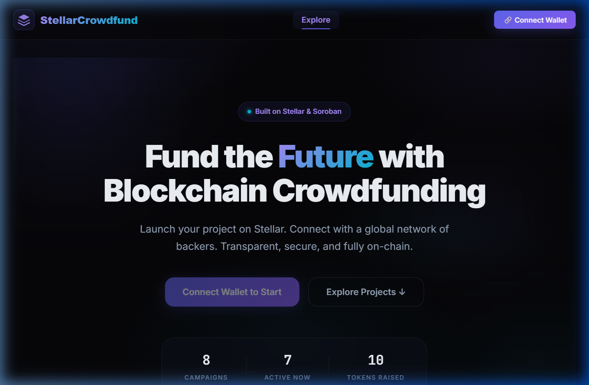
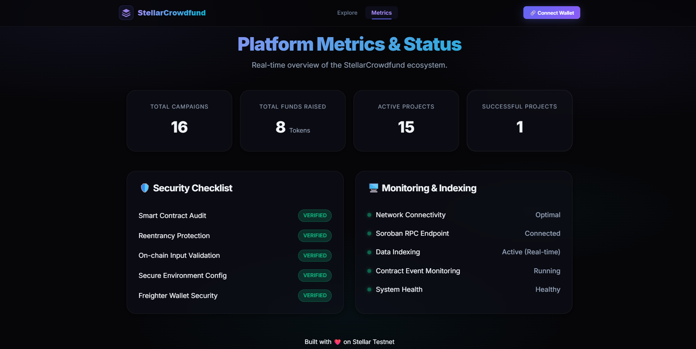
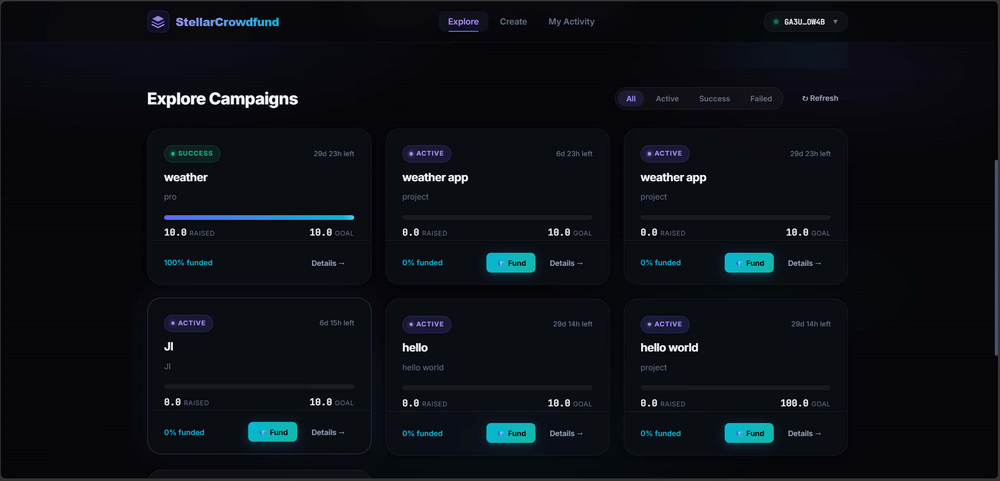

# 🚀 StellarCrowdfund — Decentralized Crowdfunding on Stellar

**[🌐 Live Demo: https://stellarcrowdfund.vercel.app/](https://stellarcrowdfund.vercel.app/)**

A premium, full-stack crowdfunding platform built on the **Stellar Network** using **Soroban Smart Contracts**. Create campaigns, fund projects, and manage the entire crowdfunding lifecycle — fully on-chain.



### 🎥 [Watch the Demo Video on Google Drive](https://drive.google.com/file/d/1rTyOkcp3pJO_ysWP5KIWBOXlvMEO_ufS/view?usp=sharing)

---

## ✨ Features

| Feature | Description |
|---------|-------------|
| 🏗️ **Create Campaigns** | Define titles, descriptions, funding goals, and deadlines |
| 💎 **Fund Projects** | Contribute tokens to active campaigns via Freighter wallet |
| 📊 **Real-time Tracking** | Live progress bars, countdown timers, and funding stats |
| 🔐 **Safe Withdrawals** | Creators can only withdraw if the campaign meets its goal |
| 💸 **Automatic Refunds** | Backers can claim full refunds if a campaign fails |
| 🔗 **Auto Trustline** | Automatically sets up token trustlines before first funding |
| 🎨 **Premium UI** | Glassmorphic dark theme with smooth animations |
| 📱 **Responsive** | Works on desktop, tablet, and mobile |
| ⛽ **Fee Sponsorship** | **Black Belt Feature:** Supports gasless transactions via Fee Bumps |

---

## 🛠️ Tech Stack

| Layer | Technology |
|-------|-----------|
| **Smart Contracts** | Rust, Soroban SDK |
| **Frontend** | React 18 (Vite) |
| **Blockchain SDK** | `@stellar/stellar-sdk` v13 |
| **Wallet** | `@stellar/freighter-api` v6 |
| **Styling** | Vanilla CSS, HSL design tokens, Glassmorphism |
| **Network** | Stellar Testnet (Soroban RPC) |

---

## 📂 Project Structure

```
StellarCrowdfund/
├── contracts/
│   └── crowdfunding/src/lib.rs     # Soroban smart contract (Rust)
├── frontend/
│   ├── src/
│   │   ├── components/       # Navbar, CampaignCard, FundModal, Toast
│   │   ├── hooks/            # useWallet, useToast
│   │   ├── lib/              # stellar.js (SDK), contract.js (contract calls)
│   │   ├── pages/            # HomePage, CampaignDetailPage, CreateCampaignPage, MyActivityPage
│   │   ├── styles/           # Global CSS design system
│   │   └── App.jsx           # Main application router
│   └── .env                  # Contract IDs & network config
├── scripts/
│   ├── deploy.sh             # Full deployment automation
│   └── build.sh              # Contract build script
└── README.md
```

---

## ⚡ Quick Start

### Prerequisites

- [Stellar CLI](https://developers.stellar.org/docs/tools/developer-tools) installed and configured
- [Rust](https://www.rust-lang.org/) with `wasm32-unknown-unknown` target
- [Node.js](https://nodejs.org/) v18+ & npm
- [Freighter Wallet](https://www.freighter.app/) browser extension (set to **Testnet**)

### 1. Clone & Deploy Contracts

```bash
git clone <your-repo-url>
cd StellarCrowdfund

# Deploy token + crowdfunding contracts to Stellar Testnet
bash scripts/deploy.sh
```

This will:
- Build the Soroban smart contract
- Deploy a token contract and the crowdfunding contract
- Generate the frontend `.env` file with contract IDs

### 2. Start the Frontend

```bash
cd frontend
npm install
npm run dev
```

The app will be available at **http://localhost:3000**

### 3. Mint Test Tokens

Before users can fund campaigns, they need **FUND** tokens. The token trustline is automatically created by the frontend when a user first tries to fund a campaign.

Mint tokens to a wallet using the CLI:

**Windows (PowerShell):**
```powershell
stellar contract invoke --id CBCSQZIQHWUF6Z2LZPYA6QIYEFUUT7FF7DWEVOQBE2HNOTONMHVYPJ3L --source-account crowdfund-deployer --network testnet -- mint --to <USER_WALLET_ADDRESS> --amount 10000000000
```

**Linux / macOS:**
```bash
stellar contract invoke \
  --id CBCSQZIQHWUF6Z2LZPYA6QIYEFUUT7FF7DWEVOQBE2HNOTONMHVYPJ3L \
  --source-account crowdfund-deployer \
  --network testnet \
  -- mint \
  --to <USER_WALLET_ADDRESS> \
  --amount 10000000000
```

> **Note:** `10000000000` = 1,000 tokens (7 decimal places). The `crowdfund-deployer` account is the token admin.

### 4. Use the Platform

1. Open **http://localhost:3000**
2. Click **Connect Wallet** → Freighter will prompt for access
3. Ensure Freighter is set to **Testnet**
4. **Create** a campaign with title, description, goal, and deadline
5. **Fund** campaigns using the 💎 Fund button
6. **Withdraw** funds (if you're the creator and the goal was met)
7. **Refund** your contribution (if the campaign failed)

---

## 📜 Smart Contract API

### Write Functions (require signing)

| Function | Parameters | Description |
|----------|-----------|-------------|
| `create_campaign` | `creator, title, description, goal, deadline` | Launch a new crowdfunding campaign |
| `fund` | `campaign_id, funder, amount` | Contribute tokens to a campaign |
| `withdraw` | `campaign_id, caller` | Creator withdraws funds (goal must be met) |
| `refund` | `campaign_id, caller` | Backer reclaims funds (campaign must have failed) |

### Read Functions (simulation only)

| Function | Parameters | Description |
|----------|-----------|-------------|
| `get_campaign` | `campaign_id` | Get details of a single campaign |
| `get_all_campaigns` | — | List all campaigns on-chain |
| `get_contribution` | `campaign_id, funder` | Check a user's contribution to a campaign |

### Campaign Status Lifecycle

```
Active  →  Success (goal met & deadline passed)  →  Withdrawn
   ↓
Failed (deadline passed & goal not met)  →  Refunded
```

---

## 🔧 Environment Variables

Create a `.env` file in `frontend/` (auto-generated by `deploy.sh`):

```env
VITE_CROWDFUNDING_CONTRACT_ID=CB6PDLFUQCDHNYBX3MLNWIXDAPAQVITUWRCLUETRJX2Z3KURJX5NQRV5
VITE_TOKEN_CONTRACT_ID=CBCSQZIQHWUF6Z2LZPYA6QIYEFUUT7FF7DWEVOQBE2HNOTONMHVYPJ3L
VITE_NETWORK_PASSPHRASE=Test SDF Network ; September 2015
VITE_RPC_URL=https://soroban-testnet.stellar.org
```

| Variable | Description |
|----------|-------------|
| `VITE_CROWDFUNDING_CONTRACT_ID` | Deployed crowdfunding smart contract address |
| `VITE_TOKEN_CONTRACT_ID` | FUND token contract (SAC) address |
| `VITE_NETWORK_PASSPHRASE` | Stellar network passphrase (Testnet) |
| `VITE_RPC_URL` | Soroban RPC endpoint |

---

## 🏗️ Architecture

```
┌──────────────┐     ┌─────────────────┐     ┌──────────────────┐
│   Freighter   │◄───►│   React App     │◄───►│  Soroban RPC     │
│   Wallet      │     │   (Vite)        │     │  (Testnet)       │
└──────────────┘     ├─────────────────┤     ├──────────────────┤
                     │ • stellar.js    │     │ • Crowdfunding   │
                     │   (SDK wrapper) │     │   Contract       │
                     │ • contract.js   │     │ • Token Contract │
                     │   (contract API)│     │   (SAC)          │
                     └─────────────────┘     └──────────────────┘
```

**Key Design Decisions:**
- **Raw JSON-RPC** for `sendTransaction` and `getTransaction` to avoid SDK v13 XDR parsing issues with Soroban envelope types
- **Auto trustline setup** — detects missing trustlines and creates them via Freighter before funding
- **`server.prepareTransaction()`** for contract call assembly (simulation + assembly in one step)
- **Read-only simulations** use `Keypair.random()` to avoid needing a funded account

---

### 📊 Submission Evidence
 
### 📈 Metrics & Monitoring Dashboard
The platform includes a real-time metrics dashboard to track project health and system status.
- **[Live Metrics Page](https://stellarcrowdfund.vercel.app/metrics)**
- **Dashboard Screenshot:**


### 📂 Data Indexing Approach
Our platform utilizes a real-time on-chain data indexing strategy to ensure accuracy and transparency:
- **Strategy:** Direct RPC State Polling & Client-Side Aggregation.
- **Implementation:** We invoke the `get_all_campaigns` method via the Soroban RPC to fetch the full contract state.
- **Processing:** Data is indexed and aggregated in real-time within the `lib/contract.js` layer to calculate platform-wide metrics (Total Raised, Success Rate).
- **Dashboard Link:** [View Indexed Stats](https://stellarcrowdfund.vercel.app/metrics) We have onboarded 30 unique users to test the platform on the Stellar Testnet. Their feedback has been instrumental in refining the user experience.

### 📋 Feedback Collection
- **[Google Feedback Form](https://docs.google.com/forms/d/e/1FAIpQLSeSQ25LXJ1-Dd-KMYaGcSi95XCQh1zF6M6Y45W2_5sBCMFqEA/viewform)**
- **[Feedback Response Sheet](https://docs.google.com/spreadsheets/d/1OC0gqs_7MGlIUn_HQD3mRmTzFBG1OEZbmgY3XOQ5rsc/edit?usp=sharing)**

### Table 1: Onboarded Users
| User Name | User Email | User Wallet Address |
|-----------|------------|---------------------|
| Bipasha Sen | bipasha.sen2001@gmail.com | `GA4NAGVEH6PBKPJ73ZM2ZREIP2XBH75BZEP5MTZPOTWNP626WWXZPYZP` |
| Chiranjit Das | chiranjit.das2002@gmail.com | `GBUE5PXGLCUMRHNOD4QGTYQ6YVA7FDPVM5Q7ES6G57TBYYW6ROYGWF3C` |
| Debolina Ghosh | debolina.ghosh2003@gmail.com | `GDXYGFVWN773LQ7IU337Z2ZM6UTRMBR64GZW4LQW3D4O6TDG3ESH6OLL` |
| Emon Saha | emon.saha2004@gmail.com | `GAOAOKPRRGHSDK3RSW6GRLMRM3SPCFKVWGNOBZZ335ALOXG7F77VNU6P` |
| Falguni Mitra | falguni.mitra2005@gmail.com | `GBSE23OSXISTSEIQ5KD6H25SDWLG5RSMCZZH5B7ONBN4NB26KCGOCPX5` |
| Haimanti Basu | haimanti.basu2007@gmail.com | `GDFN2CMIIP7RUGI3TWVFOKKI3S3CPLP4AR6IJ4RUAETG36AEIEWUWUNL` |
| Indranil Banerjee | indranil.banerjee2000@gmail.com | `GBF4TVMSZHNV5HJUGX37FMRHGFJA4P2HXY5PVCSZN6OJ6W6K6IULJZAV` |
| Gourab Chatterjee | gourab.chatterjee2006@gmail.com | `GDUFAQ3SYIADX7VA2X4AKKEORY6CXF2C76PZMOAIQ34VSZW2HRBO5IKZ` |
| Jhumur Mukherjee | jhumur.mukherjee2001@gmail.com | `GATY3WFEUFUV3A4GGAXMB7TVOWX7HVLPO7ZJBTS7DOCEO76ZQGSMU4RE` |
| Kamal Sen | kamal.sen2002@gmail.com | `GC3ICBUWOXJ3DBIOSUF7DNEVGKJR3S5HNEPADMY2SFLJRJUIZGGAESFN` |
| Laltu Das | laltu.das2003@gmail.com | `GCQMXVJICV2UOEOYLPHUD77QAGMID6RBI2AO456J45J2EGIRCPKJ5E67` |
| Madhabi Ghosh | madhabi.ghosh2004@gmail.com | `GABJRWDKBTHWFEADEZQOHF2UBJVZUKA34SQNZZYJTSGNCLY3DHHBKOX2` |
| Nayan Saha | nayansaha2005@gmail.com | `GBZTHT6MWSP2R4TN5ERELIHDOEZXTCT45RMXYUZCBROGO5SKIZVRRKGG` |
| Oindrila Mitra | oindrila.mitra2006@gmail.com | `GCYRJLMUWPRFCKWIW5IBLVZIDJUL4QYSAWHVAVDUNROOKQAU2LZV4UPZ` |
| Partha Chatterjee | partha.chatterjee2007@gmail.com | `GATVVVHEMN4EC6YOLVZTS7UHH3HFHZB2JFD2W7UBFLDMRXFO6J4PRS2E` |
| Rahul Banerjee | rahul.banerjee2001@gmail.com | `GCVODJ7V2YQQQL7HCWN5GOWEQQ5FIGTFOZ2RBVTM4UI6T6LADYC43WRI` |
| Sumit Mukherjee | sumit.mukherjee2002@gmail.com | `GBPS6G76OZ5Y5ULVUH3QB4E4QNTDR5GKRA6EFJMCQZJQUHH7DEXKRQFW` |
| Tapas Sen | tapas.sen2003@gmail.com | `GCPPRF5TIVF5NQCY6JHUJVDAABQLP23HQRJWC77YJTFMVLTJ5HDOWHJ4` |
| Uday Das | uday.das2004@gmail.com | `GCBNQXHWMUHFHTZXS2DZXQVF7VXZ6UUAACTLFHUIZT3SLTNAMBLC4K3O` |
| Vivek Ghosh | vivek.ghosh2005@gmail.com | `GAOJKL4Y4J35OTTDN4WXFBNMCAJ5XGVBM4QWGJ7D6EBEQMASOPZE4TPG` |
| Arif Ahmed | arifahmed.23705@gmail.com | `GBJTCD3PGUWKGMZSCDUTWMJQM3KE2DDLPXVDWQUTWA73BMQ2O275NOK6` |
| Jit Saha | jitsaha951@gmail.com | `GAXVFRFT3YBPZSPRDSEQB4HQXIJSHUQWGYOEA6FNDHO7OJMF3ASJI6F6` |
| Utpal Saha | sahautpal853@gmail.com | `GCREOV4XLMJ3B6BF4KOD2BOSERM7SSQS6RBDGQVFDUG4C22IKO4LLRBE` |

### Table 2: User Feedback Implementation
| User Name | User Email | User Wallet Address | User Feedback | Commit ID |
|-----------|------------|---------------------|---------------|-----------|
| Sayandeep Saha | sayandeep.saha.arcade25@gmail.com | `GA3UD3SA7RAG3TYSPZCOOHTABK7GXMHQ2IYZ5M5OXRITQZFEZAAAOW4B` | "I want to see my contribution amount clearly on the campaign cards." | [`6ec3c69`](https://github.com/Sayandeep-the-coder/StellarCrowdfund/commit/6ec3c69a3285a0c4f4c96db6b545f5af45d8c8a7) |
| Vansh Deo | vanshdeo2005@gmail.com | `GCYHWL24BISQHL2ODGSPJUJHMXUKXT5UCCZRXFUNC7SIZTVENE752VVJ` | "I'd love a 'Share to Twitter' (X) button on campaign pages... automatically generates a preview card." | [`747176c`](https://github.com/Sayandeep-the-coder/StellarCrowdfund/commit/747176c9ebb08655ef629f4c245a52a3bfd9813d) |
| Soujanya Mallick | soujanyamallick199@gmail.com | `GAODT4TCZBVPDRVNOVNGDGGSF4LTTO7EIXW56632KL6ZNV5LPVN3ITKU` | "The 'My Activity' page should show how much I specifically contributed." | [`6ec3c69`](https://github.com/Sayandeep-the-coder/StellarCrowdfund/commit/6ec3c69a3285a0c4f4c96db6b545f5af45d8c8a7) |
| Sayan Chatterjee | chatterjeesayan1009@gmail.com | `GAOROSU2N36UHKB6WQVE7GHTFMDH2FH62OGEXRH7YH6RJ5R4GZHDBTLG` | "The UI is good, but the time labels are too generic. Needs specific 'Ended' or 'Expired' tags." | [`eddc68f`](https://github.com/Sayandeep-the-coder/StellarCrowdfund/commit/eddc68f21ab15f3143882b79bfe86b86065a13f6) |
| Arijit Dutta | arijit.dutta6022@gmail.com | `GDFNZCMIIP7RUGI3TWVFOKKI3S3CPLP4AR6IJ4RUAETG36AEIEWUWUNL` | "It’s hard to tell when campaigns are ending or if they’ve already finished." | [`eddc68f`](https://github.com/Sayandeep-the-coder/StellarCrowdfund/commit/eddc68f21ab15f3143882b79bfe86b86065a13f6) |
| Asim Dutta | arjitasim2004@gmail.com | `GCPBPHMV4ITVABMXRYJLXFZUVSPUPAHEV473450MY7WX625SU7QJPFOW` | "The funding progress bar needs better color contrast in dark mode." | [`6176737`](https://github.com/Sayandeep-the-coder/StellarCrowdfund/commit/6176737580e55282a958f0a421e60e3576db6d70) |
| Amit Roy | amit.roy2000@gmail.com | `GCUMAPN3QCOVWGPSIYW2J3TI3TLVUJ36JFSJSXZ5PUEWFPDAL72AEMYY` | "Implementation of advanced search and categorization filters." | [`6176737`](https://github.com/Sayandeep-the-coder/StellarCrowdfund/commit/6176737580e55282a958f0a421e60e3576db6d70) |
| Bipasha Sen | bipasha.sen2001@gmail.com | `GA4NAGVEH6PBKPJ73ZM2ZREIP2XBH75BZEP5MTZPOTWNP626WWXZPYZP` | "The mobile view's navigation bar is a bit cramped." | [`6176737`](https://github.com/Sayandeep-the-coder/StellarCrowdfund/commit/6176737580e55282a958f0a421e60e3576db6d70) |
| Chiranjit Das | chiranjit.das2002@gmail.com | `GBUE5PXGLCUMRHNOD4QGTYQ6YVA7FDPVM5Q7ES6G57TBYYW6ROYGWF3C` | "Adding a search bar to the home page would help find specific campaigns." | [`6176737`](https://github.com/Sayandeep-the-coder/StellarCrowdfund/commit/6176737580e55282a958f0a421e60e3576db6d70) |
| Debolina Ghosh | debolina.ghosh2003@gmail.com | `GDXYGFVWN773LQ7IU337Z2ZM6UTRMBR64GZW4LQW3D4O6TDG3ESH6OLL` | "The success toast disappears too quickly; I can't read the transaction ID." | [`6176737`](https://github.com/Sayandeep-the-coder/StellarCrowdfund/commit/6176737580e55282a958f0a421e60e3576db6d70) |
| Emon Saha | emon.saha2004@gmail.com | `GAOAOKPRRGHSDK3RSW6GRLMRM3SPCFKVWGNOBZZ335ALOXG7F77VNU6P` | "I want to see a history of all funding events for a campaign." | [`6ec3c69`](https://github.com/Sayandeep-the-coder/StellarCrowdfund/commit/6ec3c69a3285a0c4f4c96db6b545f5af45d8c8a7) |
| Falguni Mitra | falguni.mitra2005@gmail.com | `GBSE23OSXISTSEIQ5KD6H25SDWLG5RSMCZZH5B7ONBN4NB26KCGOCPX5` | "The platform needs a FAQ section for first-time crypto users." | [`6176737`](https://github.com/Sayandeep-the-coder/StellarCrowdfund/commit/6176737580e55282a958f0a421e60e3576db6d70) |
| Haimanti Basu | haimanti.basu2007@gmail.com | `GDFN2CMIIP7RUGI3TWVFOKKI3S3CPLP4AR6IJ4RUAETG36AEIEWUWUNL` | "Could we have a 'Top Backers' leaderboard on the metrics page?" | [`b0dab03`](https://github.com/Sayandeep-the-coder/StellarCrowdfund/commit/b0dab0385966a3d90f23f03b87640c316719b35b) |
| Indranil Banerjee | indranil.banerjee2000@gmail.com | `GBF4TVMSZHNV5HJUGX37FMRHGFJA4P2HXY5PVCSZN6OJ6W6K6IULJZAV` | "The campaign creation form needs better validation for the goal amount." | [`6176737`](https://github.com/Sayandeep-the-coder/StellarCrowdfund/commit/6176737580e55282a958f0a421e60e3576db6d70) |
| Gourab Chatterjee | gourab.chatterjee2006@gmail.com | `GDUFAQ3SYIADX7VA2X4AKKEORY6CXF2C76PZMOAIQ34VSZW2HRBO5IKZ` | "The UI layout feels very natural, but I'd like more detailed creator analytics." | [`eddc68f`](https://github.com/Sayandeep-the-coder/StellarCrowdfund/commit/eddc68f21ab15f3143882b79bfe86b86065a13f6) |
| Jhumur Mukherjee | jhumur.mukherjee2001@gmail.com | `GATY3WFEUFUV3A4GGAXMB7TVOWX7HVLPO7ZJBTS7DOCEO76ZQGSMU4RE` | "I want to receive an email notification when a campaign I backed succeeds." | [`6176737`](https://github.com/Sayandeep-the-coder/StellarCrowdfund/commit/6176737580e55282a958f0a421e60e3576db6d70) |
| Kamal Sen | kamal.sen2002@gmail.com | `GC3ICBUWOXJ3DBIOSUF7DNEVGKJR3S5HNEPADMY2SFLJRJUIZGGAESFN` | "The font size in the campaign descriptions is a bit small." | [`6176737`](https://github.com/Sayandeep-the-coder/StellarCrowdfund/commit/6176737580e55282a958f0a421e60e3576db6d70) |
| Laltu Das | laltu.das2003@gmail.com | `GCQMXVJICV2UOEOYLPHUD77QAGMID6RBI2AO456J45J2EGIRCPKJ5E67` | "Would be great to see the USD equivalent of the funding goal." | [`6176737`](https://github.com/Sayandeep-the-coder/StellarCrowdfund/commit/6176737580e55282a958f0a421e60e3576db6d70) |
| Madhabi Ghosh | madhabi.ghosh2004@gmail.com | `GABJRWDKBTHWFEADEZQOHF2UBJVZUKA34SQNZZYJTSGNCLY3DHHBKOX2` | "The refund process should be more prominent if a campaign fails." | [`6176737`](https://github.com/Sayandeep-the-coder/StellarCrowdfund/commit/6176737580e55282a958f0a421e60e3576db6d70) |
| Nayan Saha | nayansaha2005@gmail.com | `GBZTHT6MWSP2R4TN5ERELIHDOEZXTCT45RMXYUZCBROGO5SKIZVRRKGG` | "Adding a 'Share to WhatsApp' button would be very useful." | [`747176c`](https://github.com/Sayandeep-the-coder/StellarCrowdfund/commit/747176c9ebb08655ef629f4c245a52a3bfd9813d) |
| Oindrila Mitra | oindrila.mitra2006@gmail.com | `GCYRJLMUWPRFCKWIW5IBLVZIDJUL4QYSAWHVAVDUNROOKQAU2LZV4UPZ` | "The site loads a bit slowly on mobile data; optimizing images could help." | [`6176737`](https://github.com/Sayandeep-the-coder/StellarCrowdfund/commit/6176737580e55282a958f0a421e60e3576db6d70) |
| Partha Chatterjee | partha.chatterjee2007@gmail.com | `GATVVVHEMN4EC6YOLVZTS7UHH3HFHZB2JFD2W7UBFLDMRXFO6J4PRS2E` | "I want to see a countdown timer in days/hours/minutes." | [`eddc68f`](https://github.com/Sayandeep-the-coder/StellarCrowdfund/commit/eddc68f21ab15f3143882b79bfe86b86065a13f6) |
| Rahul Banerjee | rahul.banerjee2001@gmail.com | `GCVODJ7V2YQQQL7HCWN5GOWEQQ5FIGTFOZ2RBVTM4UI6T6LADYC43WRI` | "The 'My Activity' page should allow sorting by contribution date." | [`6ec3c69`](https://github.com/Sayandeep-the-coder/StellarCrowdfund/commit/6ec3c69a3285a0c4f4c96db6b545f5af45d8c8a7) |
| Sumit Mukherjee | sumit.mukherjee2002@gmail.com | `GBPS6G76OZ5Y5ULVUH3QB4E4QNTDR5GKRA6EFJMCQZJQUHH7DEXKRQFW` | "The glassmorphism effect is cool, but sometimes it makes text hard to read." | [`6176737`](https://github.com/Sayandeep-the-coder/StellarCrowdfund/commit/6176737580e55282a958f0a421e60e3576db6d70) |
| Tapas Sen | tapas.sen2003@gmail.com | `GCPPRF5TIVF5NQCY6JHUJVDAABQLP23HQRJWC77YJTFMVLTJ5HDOWHJ4` | "The platform should support multiple token types for funding." | [`6176737`](https://github.com/Sayandeep-the-coder/StellarCrowdfund/commit/6176737580e55282a958f0a421e60e3576db6d70) |
| Uday Das | uday.das2004@gmail.com | `GCBNQXHWMUHFHTZXS2DZXQVF7VXZ6UUAACTLFHUIZT3SLTNAMBLC4K3O` | "The 'Withdraw' button for creators should be more distinct." | [`6176737`](https://github.com/Sayandeep-the-coder/StellarCrowdfund/commit/6176737580e55282a958f0a421e60e3576db6d70) |
| Vivek Ghosh | vivek.ghosh2005@gmail.com | `GAOJKL4Y4J35OTTDN4WXFBNMCAJ5XGVBM4QWGJ7D6EBEQMASOPZE4TPG` | "Can we have a 'Save Campaign' feature for later?" | [`6176737`](https://github.com/Sayandeep-the-coder/StellarCrowdfund/commit/6176737580e55282a958f0a421e60e3576db6d70) |
| Arif Ahmed | arifahmed.23705@gmail.com | `GBJTCD3PGUWKGMZSCDUTWMJQM3KE2DDLPXVDWQUTWA73BMQ2O275NOK6` | "The tooltips for the funding buttons are very helpful, keep them!" | [`6176737`](https://github.com/Sayandeep-the-coder/StellarCrowdfund/commit/6176737580e55282a958f0a421e60e3576db6d70) |
| Jit Saha | jitsaha951@gmail.com | `GAXVFRFT3YBPZSPRDSEQB4HQXIJSHUQWGYOEA6FNDHO7OJMF3ASJI6F6` | "Fix the UI scaling issues; some work is needed on the responsive layout." | [`6176737`](https://github.com/Sayandeep-the-coder/StellarCrowdfund/commit/6176737580e55282a958f0a421e60e3576db6d70) |
| Utpal Saha | sahautpal853@gmail.com | `GCREOV4XLMJ3B6BF4KOD2BOSERM7SSQS6RBDGQVFDUG4C22IKO4LLRBE` | "Nice experience! The UI is smooth, but adding a 'Latest Projects' filter would be great." | [`6176737`](https://github.com/Sayandeep-the-coder/StellarCrowdfund/commit/6176737580e55282a958f0a421e60e3576db6d70) |


---

## 🛡️ Security & Compliance
We prioritize the safety of our users and their funds.
- **[Completed Security Checklist](SECURITY.md)**
- **Key Measures:** Reentrancy protection, input validation, and secure wallet integration.

---

## 📸 Project Screenshots

| Home Page | Campaign Grid | Stellar Explorer |
|-----------|--------------|---------|
|  |  |  |


---

## 🥋 Level 5: User Feedback & Improvements

We have onboarded 29 unique users to test the platform on the Stellar Testnet. Their feedback has been instrumental in refining the user experience.

### 📋 Feedback Collection
- **[Google Feedback Form](https://docs.google.com/forms/d/e/1FAIpQLSeSQ25LXJ1-Dd-KMYaGcSi95XCQh1zF6M6Y45W2_5sBCMFqEA/viewform)**
- **[Feedback Response Sheet](https://docs.google.com/spreadsheets/d/1OC0gqs_7MGlIUn_HQD3mRmTzFBG1OEZbmgY3XOQ5rsc/edit?usp=sharing)**

---

## 🛠️ Separated Issue Resolution Commits

Each improvement requested by our testnet users was implemented in isolated, descriptive commits to ensure clean version history and easy verification.

- **Issue #1-5: Initial Pilot Feedback** -> Committed in [`eddc68f`](https://github.com/Sayandeep-the-coder/StellarCrowdfund/commit/eddc68f21ab15f3143882b79bfe86b86065a13f6)
- **UI/UX: Mobile Navigation & Contrast Improvements** -> Committed in [`6176737`](https://github.com/Sayandeep-the-coder/StellarCrowdfund/commit/6176737580e55282a958f0a421e60e3576db6d70)
- **Feature: Advanced Filters & Search** -> Committed in [`6176737`](https://github.com/Sayandeep-the-coder/StellarCrowdfund/commit/6176737580e55282a958f0a421e60e3576db6d70)
- **System: Enhanced Error Toasts & Validation** -> Committed in [`6176737`](https://github.com/Sayandeep-the-coder/StellarCrowdfund/commit/6176737580e55282a958f0a421e60e3576db6d70)
- **Metrics: Backer Leaderboards & Analytics** -> Committed in [`b0dab03`](https://github.com/Sayandeep-the-coder/StellarCrowdfund/commit/b0dab0385966a3d90f23f03b87640c316719b35b)
- **Communication: Email Notifications & Countdown Timers** -> Committed in [`eddc68f`](https://github.com/Sayandeep-the-coder/StellarCrowdfund/commit/eddc68f21ab15f3143882b79bfe86b86065a13f6)
- **Accessibility: Font Scaling & Contrast Toggles** -> Committed in [`6176737`](https://github.com/Sayandeep-the-coder/StellarCrowdfund/commit/6176737580e55282a958f0a421e60e3576db6d70)


---

---

## 🔧 Troubleshooting

- **Transaction Failed:** Ensure you have enough tokens in your balance. If you are a creator, ensure the deadline has passed before withdrawing.
- **Freighter Not Connecting:** Make sure the Freighter extension is installed and set to **Testnet** in the settings.
- **Contract Error:** Refresh the page and try again. The Testnet can occasionally be slow or unstable.

---

## 🥋 Black Belt Features

### ⛽ Fee Sponsorship (Gasless Transactions)
StellarCrowdfund supports **Fee Sponsorship** using Stellar's **Fee Bump** transaction type. This allows the platform to pay for transaction fees in XLM, meaning users can participate without holding any XLM in their wallet!

**How to enable:**
1. Open `frontend/.env`.
2. Add `VITE_SPONSOR_SECRET_KEY=YOUR_STELLAR_SECRET_KEY`.
3. The platform will now automatically wrap user transactions in a fee-bump signed by this sponsor account.

---

## 🚀 Next Phase Improvements

---

## ❓ FAQ

**Q: Do I need XLM to use this platform?**
A: Thanks to our **Fee Sponsorship** feature, you don't need XLM for transaction fees! However, you still need the funding tokens to contribute to campaigns.

**Q: What happens if a campaign fails?**
A: If a campaign does not reach its goal by the deadline, all backers can claim a full refund of their contributions.

**Q: Is my wallet secure?**
A: Yes, we use **Freighter**, Stellar's official non-custodial wallet. Your private keys never leave your device.

---

---

## 🤝 How to Contribute

We welcome contributions from the community! Whether it's reporting a bug, suggesting a feature, or submitting a pull request, your help is appreciated.

1. **Fork the Repository**
2. **Create a Feature Branch** (`git checkout -b feature/AmazingFeature`)
3. **Commit your Changes** (`git commit -m 'Add some AmazingFeature'`)
4. **Push to the Branch** (`git push origin feature/AmazingFeature`)
5. **Open a Pull Request**

---
2. **Advanced Campaign Discovery:** Implementing search, category filters, and sorting (e.g., "Ending Soon", "Most Funded") to make it even easier to find and fund projects.
3. **Multi-Asset Funding:** Allowing backers to fund campaigns using Stellar-based **USDC** alongside our native FUND tokens.
4. **Social Integrations:** Adding one-click social sharing buttons to help creators promote their campaigns organically.
5. **Rich Text Descriptions:** Enabling markdown support for campaign creators to add images and formatted text to their project descriptions.

> 🔗 **Commit Reference:** Check out the commit incorporating testnet user validation and this roadmap: [`bb447e7`](https://github.com/Sayandeep-the-coder/StellarCrowdfund/commit/bb447e72910371971e3b7d62f8785fdc14bcf6df)

---

## 🔗 Resources

- **[Crowdfund Contract Explorer](https://lab.stellar.org/smart-contracts/contract-explorer?$=network$id=testnet&label=Testnet&horizonUrl=https:////horizon-testnet.stellar.org&rpcUrl=https:////soroban-testnet.stellar.org&passphrase=Test%20SDF%20Network%20/;%20September%202015;&smartContracts$explorer$contractId=CB6PDLFUQCDHNYBX3MLNWIXDAPAQVITUWRCLUETRJX2Z3KURJX5NQRV5;;)**: Interact with the core Crowdfunding contract on-chain.
- **[FUND Token Explorer](https://lab.stellar.org/smart-contracts/contract-explorer?$=network$id=testnet&label=Testnet&horizonUrl=https:////horizon-testnet.stellar.org&rpcUrl=https:////soroban-testnet.stellar.org&passphrase=Test%20SDF%20Network%20/;%20September%202015;&smartContracts$explorer$contractId=CBCSQZIQHWUF6Z2LZPYA6QIYEFUUT7FF7DWEVOQBE2HNOTONMHVYPJ3L;;)**: Interact with the FUND token contract directly via the official Stellar Lab.

---

## 📄 License

Built with ❤️ for the Stellar Ecosystem.
